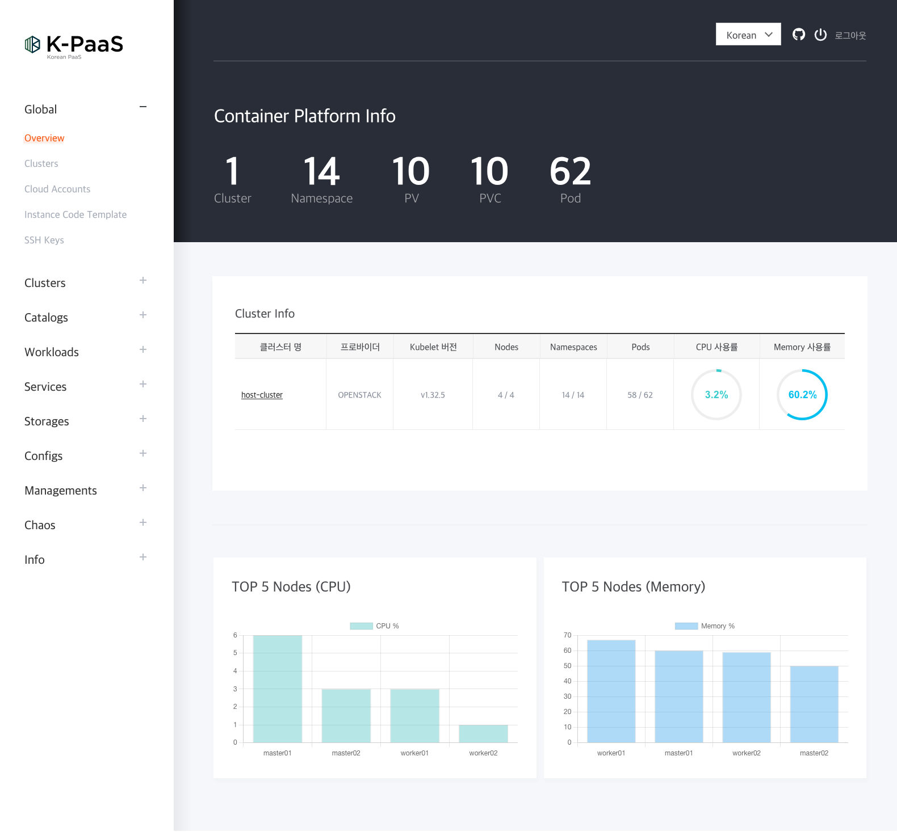

# K-PaaS Local Install

[](https://opensource.org/licenses/Apache-2.0)


[](https://github.com/dasomel/k-paas?tab=readme-ov-file#developer)

[English](README.md) | 한국어



## Description
- 로컬(Arm 기반 CPU)에서 K-PaaS를 구동하기 위한 Vagrant와 Virtualbox 기반의 ShellScript
- 기본적으로 자동화되어 있음
- 로컬에서 K-PaaS 설치를 통한 사용자 접근성 및 이해도 향상
- 설치 과정에서 오류에 대한 트러블슈팅 안내
- K-PaaS 최신 버전(v1.6.2) 적용

## Glossary
- Vagrant
    - 가상 환경을 손쉽게 설정하고 관리하기 위한 도구
    - 가상 머신을 쉽게 생성하고, 프로비저닝1)하며, 관리
    - 개발 환경이나 테스트 환경을 빠르게 구축하고 공유
    - 가상화 기술을 기반으로 하며, 다양한 가상화 플랫폼을 지원
    - 개발자들은 Vagrant를 사용하여 프로젝트 간의 일관된 환경을 유지하고, 팀 간의 협업이 용이
- virtualbox
    - x86 가상화 소프트웨어
    - 이 소프트웨어는 다양한 운영 체제에서 동작하며, 가상머신을 생성하고 관리
    - 하나의 컴퓨터에서 여러 개의 가상머신을 실행
    - 다양한 운영 체제나 환경에서 소프트웨어를 테스트하거나 개발
    - 무료이며 오픈 소스로 제공되어 사용자들이 자유롭게 활용 가능
    - Oracle Corporation에 의해 개발되었으며, 다양한 운영 체제와 호환되는 특징
- Kubespray
    - Kubernetes를 손쉽게 배포하고 관리하기 위한 오픈 소스 도구
    - Ansible을 기반으로 하여 여러 대의 서버에 Kubernetes 클러스터를 배포하고 설정하는 작업을 자동화
    - 개발자나 시스템 관리자는 Kubernetes를 사용하여 컨테이너 기반의 어플리케이션을 효과적으로 관리 가능
    - 클러스터를 손쉽게 구성하고 필요에 따라 확장 가능
    - 다양한 환경에서 Kubernetes를 일관되게 배포하고 유지보수가 용이
    - Ansible을 통한 구성 파일을 사용하므로 사용자는 설정을 쉽게 변경하거나 다양한 환경에 맞게 조정 가능
    - Kubernetes를 더 쉽게 사용할 수 있도록 도와주는 유용한 도구
- Ansible
    - 오픈 소스 인프라 자동화 도구로, 서버의 프로비저닝, 설정 관리, 배포 등의 작업을 자동화하는 데 사용
    - 간단하고 가독성이 높은 YAML 형식의 구성 파일을 통해 작업을 정의하고, SSH를 통해 원격 서버에 명령을 전송하여 작업을 수행
    - 에이전트가 필요하지 않으며, 목표 서버에 Python이 설치되어야 함
    - 이를 통해 에이전트를 설치하거나 관리하지 않고도 간편하게 자동화 작업을 수행
    - 다양한 환경에서 사용 가능하며, 클라우드 환경부터 온프레미스 서버까지 다양한 인프라 자원을 효과적으로 관리
    - 개발자, 시스템 관리자, 데브옵스 엔지니어 등 다양한 역할의 사용자들에게 널리 사용되며, 자동화된 작업을 통해 인프라를 안정적이고 일관되게 유지가 용이

## Test device specifications
- Arm MacBook

## Installed Portal Demo


## Getting Started

### Installation
```shell
# ex: vagrant_20240607_201213.log
vagrant up &> ./logs/vagrant_$(date +%Y%m%d_%H%M%S).log
```
### VM stop
```shell
vagrant suspend
```
### VM destory
```shell
vagrant destroy -f
```

### Log
- vagrant
  
- platform
  

### Platform installation complete
```shell
vagrant@master01:~$ kubectl get po -A
NAMESPACE        NAME                                                    READY   STATUS             RESTARTS         AGE
chaos-mesh       chaos-controller-manager-6648dff67b-8dv6w               1/1     Running            1 (25h ago)      26h
chaos-mesh       chaos-daemon-49qvk                                      1/1     Running            0                26h
chaos-mesh       chaos-daemon-8tshd                                      1/1     Running            0                26h
chaos-mesh       chaos-dashboard-58d8d8589c-tvsl5                        1/1     Running            0                26h
chaos-mesh       chaos-dns-server-6cbc94c77-q8mc4                        1/1     Running            0                26h
chartmuseum      chartmuseum-648968c7dd-n7cjg                            1/1     Running            0                26h
cp-portal        cp-portal-api-deployment-56b5c87fcd-295cs               1/1     Running            0                22h
cp-portal        cp-portal-catalog-api-deployment-6f94b7d5c-qmp9p        1/1     Running            0                23h
cp-portal        cp-portal-chaos-api-deployment-74f5955f8d-22697         1/1     Running            0                23h
cp-portal        cp-portal-chaos-collector-deployment-69f847bff9-9jc8k   1/1     Running            0                23h
cp-portal        cp-portal-common-api-deployment-7b48b54788-zk75r        1/1     Running            0                22h
cp-portal        cp-portal-metric-api-deployment-575f9d4df8-qvf85        1/1     Running            0                23h
cp-portal        cp-portal-terraman-deployment-db5544bb4-v6lcz           1/1     Running            0                23h
cp-portal        cp-portal-ui-deployment-788d99bb45-x8hn4                1/1     Running            0                21h
default          nfs-subdir-external-provisioner-59b6cdb74d-dkwlm        1/1     Running            3 (25h ago)      46h
harbor           harbor-core-547d8bcf7b-vhr5r                            1/1     Running            0                26h
harbor           harbor-jobservice-5db8b59574-hbn49                      1/1     Running            0                26h
harbor           harbor-portal-7c8cf785d6-h6bg4                          1/1     Running            0                26h
harbor           harbor-postgresql-0                                     1/1     Running            0                26h
harbor           harbor-redis-master-0                                   1/1     Running            1 (23h ago)      26h
harbor           harbor-registry-6fd978fbf5-nchs8                        2/2     Running            0                26h
harbor           harbor-trivy-0                                          1/1     Running            0                26h
ingress-nginx    ingress-nginx-admission-create-4k5cr                    0/1     Completed          0                46h
ingress-nginx    ingress-nginx-admission-patch-gfqdn                     0/1     Completed          0                46h
ingress-nginx    ingress-nginx-controller-74f695ff79-mp5xx               1/1     Running            0                46h
keycloak         keycloak-0                                              1/1     Running            0                21h
keycloak         keycloak-1                                              1/1     Running            0                21h
kube-system      calico-kube-controllers-695788f969-6kp65                1/1     Running            27 (23h ago)     46h
kube-system      calico-node-6m8st                                       1/1     Running            0                46h
kube-system      calico-node-jlh7j                                       1/1     Running            1                46h
kube-system      calico-node-s2nqb                                       1/1     Running            0                46h
kube-system      calico-node-zvlsr                                       1/1     Running            1                46h
kube-system      coredns-dbd95956c-mp6k4                                 1/1     Running            0                20h
kube-system      coredns-dbd95956c-stbd5                                 1/1     Running            0                20h
kube-system      dns-autoscaler-846b5fbd88-pvvfg                         1/1     Running            0                46h
kube-system      kube-apiserver-master01                                 1/1     Running            30 (23h ago)     46h
kube-system      kube-apiserver-master02                                 1/1     Running            29               46h
kube-system      kube-controller-manager-master01                        1/1     Running            5                46h
kube-system      kube-controller-manager-master02                        1/1     Running            4                46h
kube-system      kube-proxy-qn8rn                                        1/1     Running            0                46h
kube-system      kube-proxy-r78kt                                        1/1     Running            0                46h
kube-system      kube-proxy-rbvmt                                        1/1     Running            1                46h
kube-system      kube-proxy-zw65x                                        1/1     Running            1                46h
kube-system      kube-scheduler-master01                                 1/1     Running            5                46h
kube-system      kube-scheduler-master02                                 1/1     Running            3                46h
kube-system      metrics-server-65765bb6cf-qtzdb                         1/1     Running            0                46h
kube-system      nodelocaldns-8vmk7                                      0/1     CrashLoopBackOff   48 (2m53s ago)   46h
kube-system      nodelocaldns-9pnm4                                      0/1     CrashLoopBackOff   49 (2m32s ago)   46h
kube-system      nodelocaldns-9s4z7                                      1/1     Running            0                46h
kube-system      nodelocaldns-zccff                                      1/1     Running            0                46h
kyverno          kyverno-admission-controller-7b74bfcfcb-gtjjx           1/1     Running            25 (23h ago)     46h
kyverno          kyverno-background-controller-7ff58cc7cb-sdgdg          1/1     Running            3 (25h ago)      46h
kyverno          kyverno-cleanup-controller-6999cc56d9-s4qvk             1/1     Running            25 (23h ago)     46h
kyverno          kyverno-reports-controller-64d994cdc5-nxb6n             1/1     Running            3 (25h ago)      46h
mariadb          mariadb-0                                               1/1     Running            0                26h
metallb-system   controller-68cccbf98c-8s2m9                             1/1     Running            2 (46h ago)      46h
metallb-system   speaker-2kzd8                                           1/1     Running            0                46h
metallb-system   speaker-5ngd9                                           1/1     Running            1                46h
metallb-system   speaker-78fx7                                           1/1     Running            2 (23h ago)      46h
metallb-system   speaker-shhv6                                           1/1     Running            0                46h
openbao          openbao-0                                               1/1     Running            0                26h
openbao          openbao-agent-injector-6567764cc9-rx54t                 1/1     Running            0                26h
```

### Local(PC) setting
- Macbook, Linux
- File: /etc/hosts
```shell
sudo cat << EOF | sudo tee -a /etc/hosts
192.168.100.200 cluster-endpoint
192.168.100.201 k-paas.io
192.168.100.201 openbao.k-paas.io
192.168.100.201 harbor.k-paas.io
192.168.100.201 keycloak.k-paas.io
192.168.100.201 portal.k-paas.io
192.168.100.201 chartmuseum.k-paas.io
EOF
```
- windows
- File: C:\Windows\System32\drivers\etc\hosts
- Run cmd as administrator
```shell
echo.192.168.100.200 cluster-endpoint>>   %SystemRoot%\system32\drivers\etc\hosts
echo.192.168.100.201 k-paas.io>>          %SystemRoot%\system32\drivers\etc\hosts
echo.192.168.100.201 vault.k-paas.io>>    %SystemRoot%\system32\drivers\etc\hosts
echo.192.168.100.201 harbor.k-paas.io>>   %SystemRoot%\system32\drivers\etc\hosts
echo.192.168.100.201 keycloak.k-paas.io>> %SystemRoot%\system32\drivers\etc\hosts
echo.192.168.100.201 portal.k-paas.io>>   %SystemRoot%\system32\drivers\etc\hosts
```

## Stack
- **Language**: Shellscript
- **Deploy**: Local NoteBook(Intel Macbook)

## Project Structure

```markdown
K-paas
├── docs
│   └── images
├── logs
└── scripts
    ├── arm
    └── variable
```

| Directory | Note                        | Type       |
|-----------|-----------------------------|------------|
| docs      | document                    | .md        |
| images    | images, video               | .png, .gif |
| logs      | vagrant logs                | .log       |
| scripts   | vagrant install shellscript | .sh        |
| arm       | arm support shell           | .sh        |
| variable  | cp-cluster-vars.sh          | .sh        |

## Founder
*  **이기하** ([dasomel](https://github.com/dasomel))

## 감사의 말
이 프로젝트는 [카카오엔터프라이즈](https://kakaoenterprise.com)의 지원 덕분에 더욱 발전할 수 있었습니다.  
특히, 다음과 같은 지원에 깊은 감사를 드립니다.
* 클라우드 리소스 제공 


