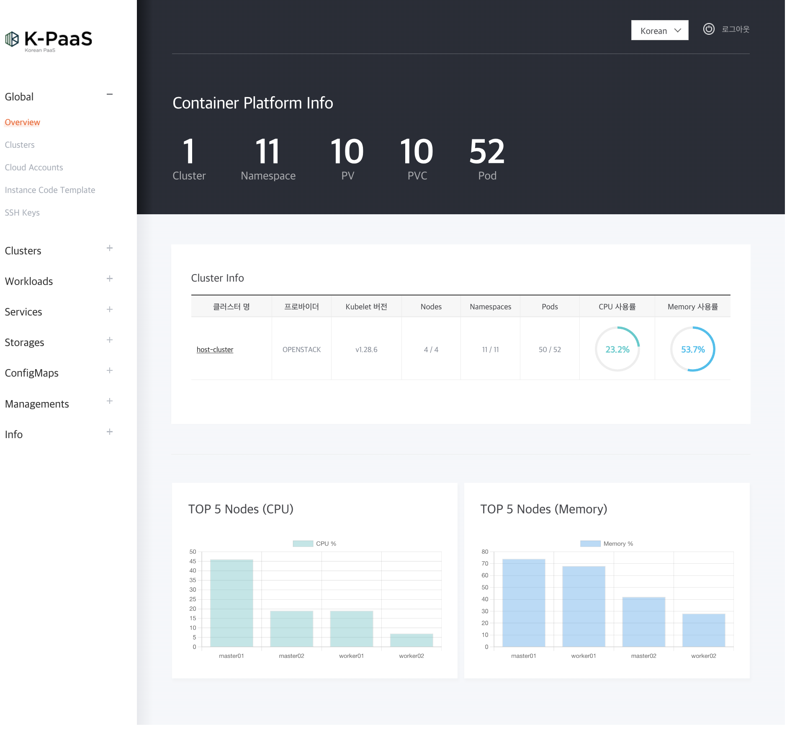

# K-PaaS Local Install

[](https://opensource.org/licenses/Apache-2.0)


[](https://github.com/dasomel/k-paas?tab=readme-ov-file#developer)

> K-PaaS Local(PC) Install
 


## Description
- 로컬(Intel 기반 CPU)에서 K-PaaS를 구동하기 위한 Vagrant와 virtualbox 기반의 ShellScript
- 기본적으로 모두 자동화되어 있음(실행시 모두 자동 설치)
- 로컬에서 K-PaaS 설치를 통한 사용자 접근성 및 이해도 향상
- 설치 과정에서 오류에 대한 트러블슈팅 안내
- 최신 버전(v1.5.1) 적용

## Glossary
- Vagrant
- virtualbox
- ShellScript

## Test device specifications
- Intel MacBook

## Installed Portal Demo


## Getting Started

### Installation
```shell
vagrant up &> ./logs/vagrant_$(date +%Y%m%d_%H%M%S).log
```
### VM stop
```shell
vagrant suspend
```
### VM destory
```shell
vagrant destroy -f
```

### Local(PC) setting
```shell
sudo cat << EOF | sudo tee -a /etc/hosts
192.168.100.201 k-paas.io
192.168.100.201 vault.k-paas.io
192.168.100.201 harbor.k-paas.io
192.168.100.201 keycloak.k-paas.io
192.168.100.201 portal.k-paas.io
EOF
```

## Stack
- **Language**: Shellscript
- **Deploy**: Local NoteBook(Intel Macbook)

## Project Structure

```markdown
K-paas
├── docs
├── logs
└── scripts
    └── variable
```

| Directory | Note                        | Type |
|-----------|-----------------------------|------|
| docs      | document                    | .md  |
| logs      | vagrant logs                | .log |
| scripts   | vagrant intstll shellscript | .sh  |
| variable  | cp-cluster-vars.sh          | .sh  |

## Developer
*  **이기하** ([dasomel](https://github.com/dasomel))


