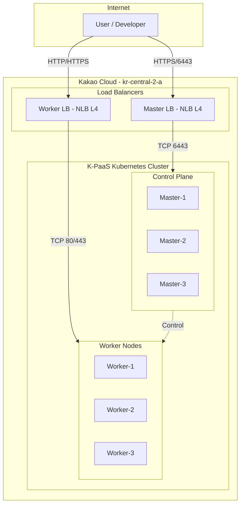
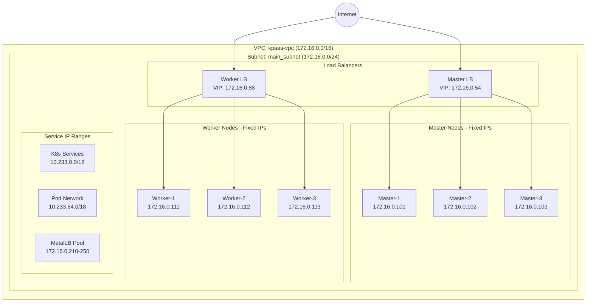
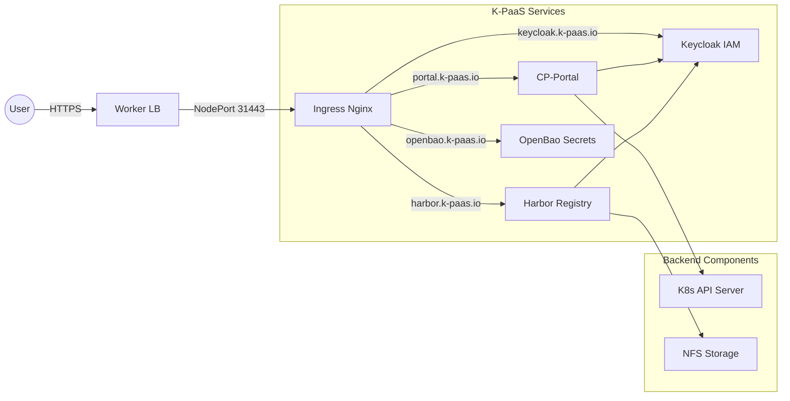
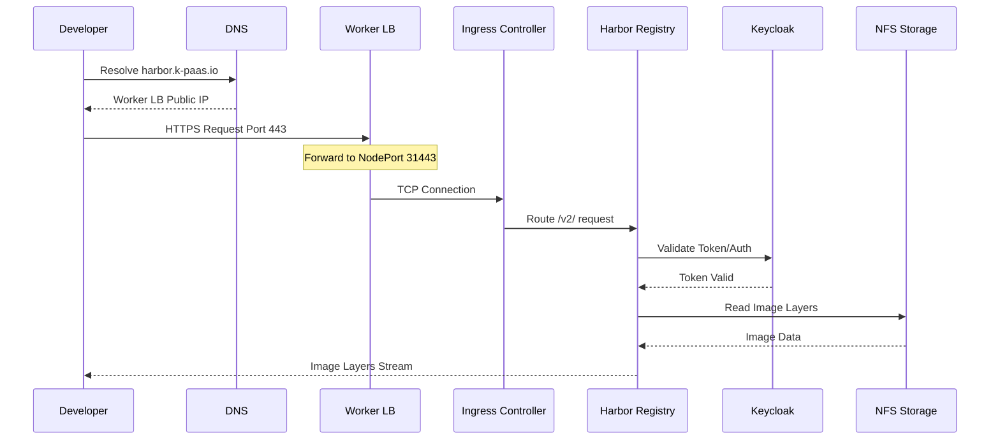
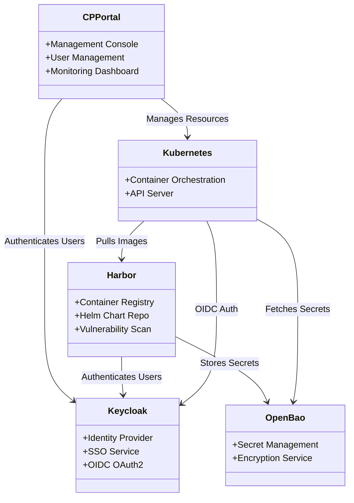

# K-PaaS Architecture Diagrams

This document visualizes the K-PaaS architecture using Mermaid diagrams, based on the [Architecture Documentation](ARCHITECTURE.md).

## 1. System Overview

High-level view of the K-PaaS platform on Kakao Cloud.

## 2. Network Architecture

Detailed network topology including VPC, Subnets, and IP allocations.

## 3. Service Architecture & Ingress

How external traffic reaches applications via Ingress Controller.

## 4. Data Flow: Container Image Pull

The flow of a developer pulling a container image from Harbor.

## 5. Component Interaction

Relationships between key K-PaaS components.

