# K-PaaS 프로젝트 상세 분석

## 📋 목차

- [프로젝트 개요](#프로젝트-개요)
- [전체 아키텍처](#전체-아키텍처)
- [프로젝트 구조](#프로젝트-구조)
- [기술 스택](#기술-스택)
- [배포 환경](#배포-환경)
- [데이터 흐름](#데이터-흐름)
- [주요 컴포넌트 분석](#주요-컴포넌트-분석)
- [보안 구성](#보안-구성)
- [확장성 및 성능](#확장성-및-성능)

---

## 프로젝트 개요

### 기본 정보

| 항목 | 내용 |
|------|------|
| **프로젝트명** | K-PaaS Lite |
| **버전** | 2.0.0 |
| **K-PaaS 버전** | 1.7.0 |
| **Kubernetes 버전** | v1.33.5 |
| **라이선스** | Apache 2.0 |
| **언어** | Shell Script, Terraform (HCL) |

### 프로젝트 목적

K-PaaS는 한국형 클라우드 플랫폼을 로컬 및 클라우드 환경에 쉽게 배포할 수 있도록 자동화한 프로젝트입니다:

- **로컬 배포**: Vagrant + VirtualBox를 사용한 ARM 기반 로컬 환경 지원
- **클라우드 배포**: Terraform을 통한 Kakao Cloud 자동 프로비저닝
- **자동화**: 모든 설치 과정을 Shell Script로 자동화
- **교육 및 테스트**: 개발자가 K-PaaS를 쉽게 학습하고 테스트할 수 있는 환경 제공

---

## 전체 아키텍처

### 시스템 전체 구조도

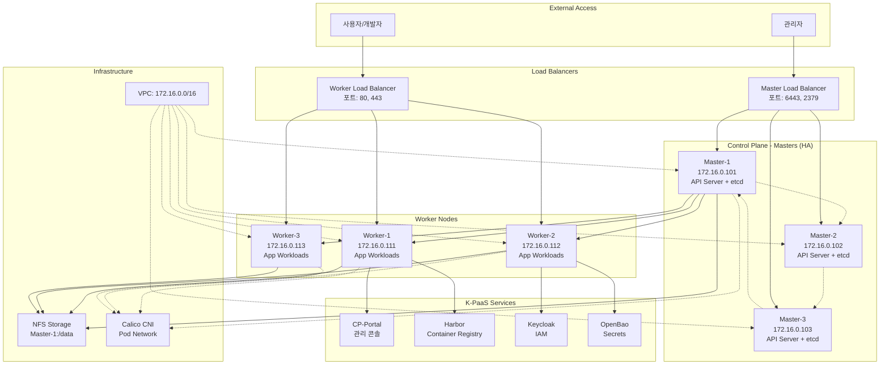

### 네트워크 토폴로지

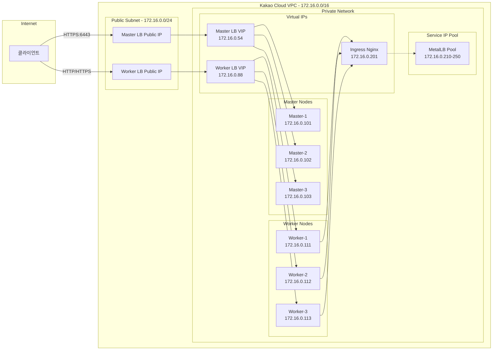

### Kubernetes 클러스터 아키텍처

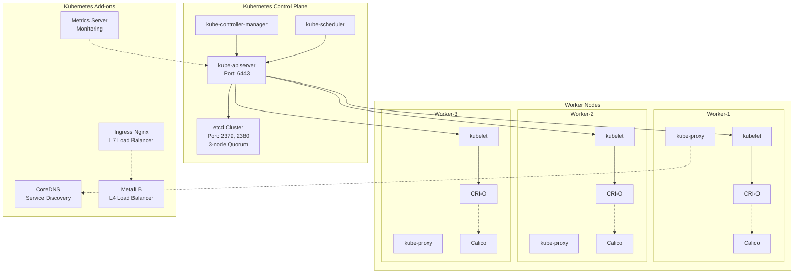

---

## 프로젝트 구조

### 디렉토리 구조도

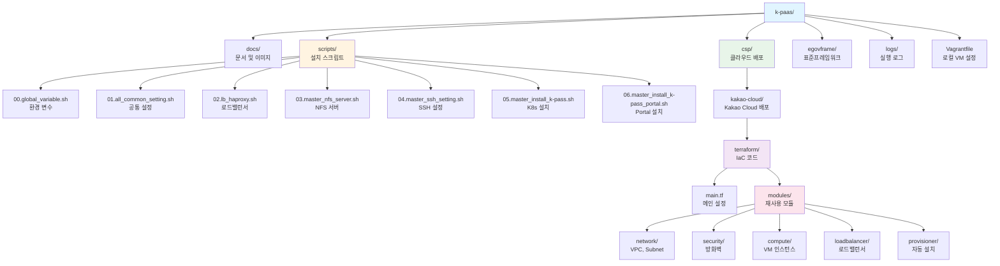

### 주요 파일 분석

#### 로컬 배포 (Vagrant)

| 파일 | 역할 | 라인수 |
|------|------|--------|
| `Vagrantfile` | VM 프로비저닝 설정 | 85 |
| `scripts/00.global_variable.sh` | 전역 환경 변수 | ~100 |
| `scripts/01.all_common_setting.sh` | 모든 노드 공통 설정 | ~200 |
| `scripts/05.master_install_k-pass.sh` | Kubernetes 클러스터 설치 | ~500 |
| `scripts/06.master_install_k-pass_portal.sh` | CP-Portal 설치 | ~300 |

#### 클라우드 배포 (Terraform)

| 파일 | 역할 | 리소스 |
|------|------|--------|
| `main.tf` | 모듈 오케스트레이션 | 5개 모듈 |
| `modules/network/main.tf` | VPC, Subnet 생성 | 3개 |
| `modules/security/main.tf` | Security Group | 1개 + 20개 룰 |
| `modules/compute/main.tf` | Master/Worker VM | 6개 인스턴스 |
| `modules/loadbalancer/main.tf` | Load Balancer | 2개 LB |
| `modules/provisioner/main.tf` | 자동 설치 스크립트 | 6개 스크립트 |

---

## 기술 스택

### 인프라 기술

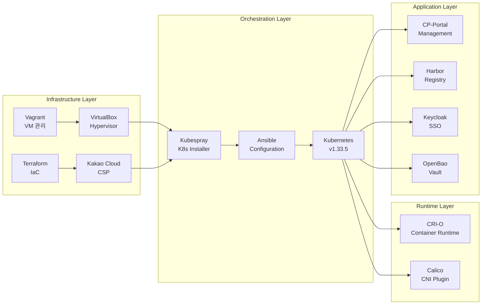

### 기술 스택 상세

#### 1. 로컬 환경 (Vagrant)

| 기술 | 버전 | 역할 |
|------|------|------|
| **Vagrant** | 2.x | 가상 머신 자동 프로비저닝 |
| **VirtualBox** | 6.x/7.x | 하이퍼바이저 (ARM 지원) |
| **Ubuntu** | 22.04 LTS | 게스트 OS |
| **Shell Script** | Bash 5.x | 자동화 스크립트 |

**노드 구성**:
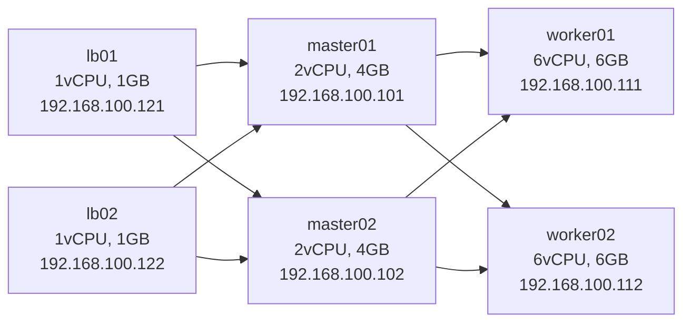

#### 2. 클라우드 환경 (Kakao Cloud)

| 기술 | 버전 | 역할 |
|------|------|------|
| **Terraform** | >= 1.0 | Infrastructure as Code |
| **kakaocloud Provider** | v0.2.0 | Kakao Cloud 리소스 관리 |
| **Ubuntu** | 24.04 LTS | 서버 OS |
| **Instance Type** | t1i.xlarge | 4vCPU, 16GB RAM |

#### 3. Kubernetes 플랫폼

| 컴포넌트 | 버전 | 설명 |
|----------|------|------|
| **Kubernetes** | v1.33.5 | 컨테이너 오케스트레이션 |
| **Kubespray** | Latest | Ansible 기반 K8s 설치 도구 |
| **CRI-O** | v1.33.5 | OCI 기반 컨테이너 런타임 |
| **Calico** | Latest | CNI 네트워크 플러그인 |
| **CoreDNS** | Latest | 클러스터 DNS |
| **MetalLB** | Latest | 베어메탈 로드밸런서 |
| **Ingress Nginx** | Latest | L7 로드밸런서 |

#### 4. K-PaaS 애플리케이션

| 서비스 | 포트 | 역할 |
|--------|------|------|
| **CP-Portal** | 8080 | 컨테이너 플랫폼 관리 콘솔 |
| **Harbor** | 80/443 | 프라이빗 컨테이너 레지스트리 |
| **Keycloak** | 8080 | 통합 인증/인가 (SSO) |
| **OpenBao** | 8200 | 시크릿 관리 (Vault Fork) |
| **ChartMuseum** | 8080 | Helm Chart 저장소 |
| **Chaos Mesh** | - | 카오스 엔지니어링 |

---

## 배포 환경

### 배포 프로세스 플로우

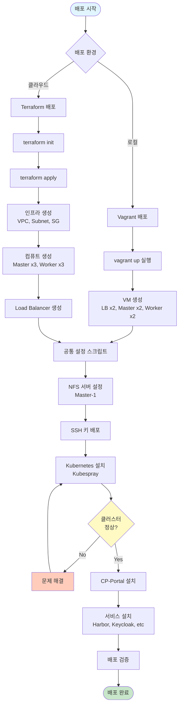

### 로컬 배포 상세

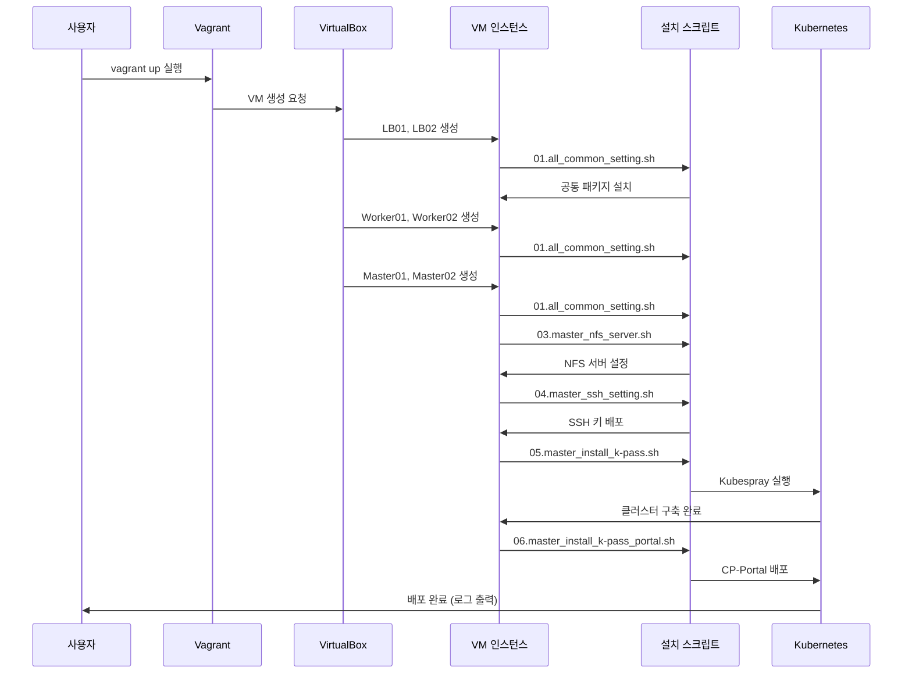

### 클라우드 배포 상세 (Terraform)

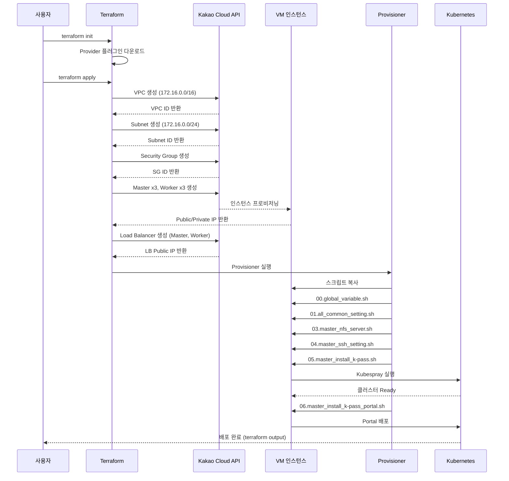

---

## 데이터 흐름

### 사용자 요청 플로우 (외부 → 애플리케이션)

```mermaid
flowchart LR
    subgraph External
        User[사용자 브라우저]
    end

    subgraph "Public Network"
        DNS[DNS<br/>portal.k-paas.io<br/>→ Public IP]
    end

    subgraph "Load Balancer"
        WorkerLB[Worker LB<br/>Public IP:443]
    end

    subgraph "Worker Nodes"
        NodePort[NodePort 31443<br/>모든 Worker 노드]
    end

    subgraph "Ingress"
        Ingress[Ingress Nginx<br/>172.16.0.201]
    end

    subgraph "Service"
        PortalSvc[Portal Service<br/>ClusterIP]
    end

    subgraph "Application"
        PortalPod[Portal Pod<br/>Container:8080]
    end

    subgraph "Backend Services"
        K8sAPI[Kubernetes API]
        KeycloakSvc[Keycloak<br/>인증]
    end

    User -->|1. HTTPS 요청| DNS
    DNS -->|2. IP 반환| User
    User -->|3. TLS 연결| WorkerLB
    WorkerLB -->|4. 트래픽 분산| NodePort
    NodePort -->|5. 포워딩| Ingress
    Ingress -->|6. 호스트 기반 라우팅| PortalSvc
    PortalSvc -->|7. Pod 로드밸런싱| PortalPod
    PortalPod -->|8. 인증 요청| KeycloakSvc
    KeycloakSvc -->|9. Token 발급| PortalPod
    PortalPod -->|10. API 호출| K8sAPI
    K8sAPI -->|11. 리소스 반환| PortalPod
    PortalPod -->|12. 응답| User
```

### Pod 간 통신 플로우

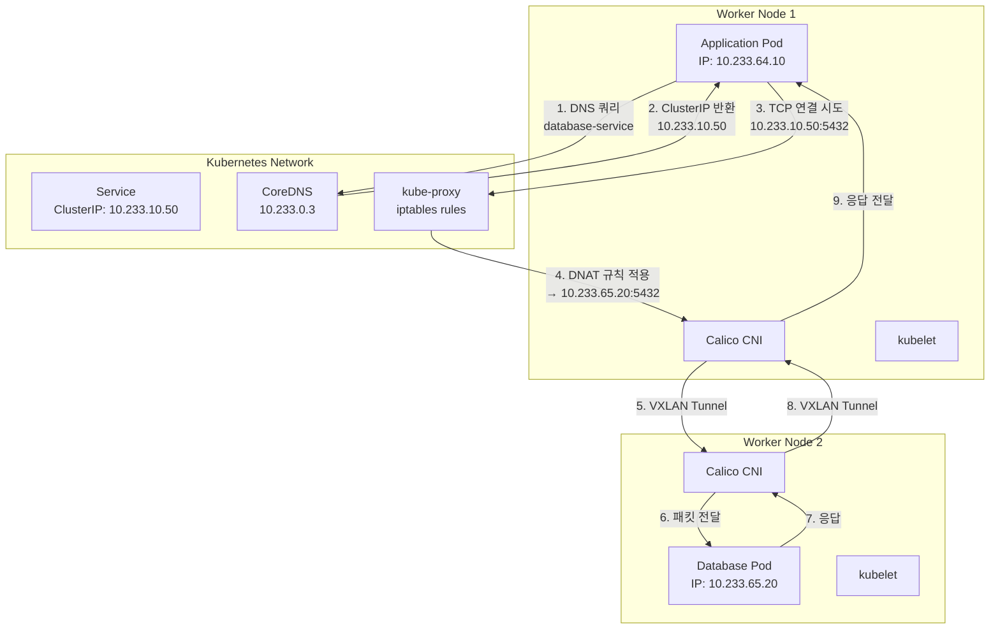

### 스토리지 데이터 흐름

```mermaid
flowchart LR
    subgraph "Application"
        App[Application Pod]
        PVC[PersistentVolumeClaim<br/>harbor-pvc<br/>20Gi]
    end

    subgraph "Kubernetes Storage"
        PV[PersistentVolume<br/>NFS Type]
        SC[StorageClass<br/>nfs-client]
        Provisioner[NFS Provisioner<br/>Pod]
    end

    subgraph "NFS Server (Master-1)"
        NFSServer[NFS Service<br/>172.16.0.101:/data]
        Export[/data/harbor-pvc-xxx]
    end

    subgraph "Physical Storage"
        Disk[Local Disk<br/>/dev/vda<br/>200GB SSD]
    end

    App -->|1. Volume Mount 요청| PVC
    PVC -->|2. Bound to| PV
    PV -->|3. Provisioned by| SC
    SC -->|4. Dynamic provisioning| Provisioner
    Provisioner -->|5. NFS 마운트 요청| NFSServer
    NFSServer -->|6. Export 생성| Export
    Export -->|7. 물리 디스크 사용| Disk
    Disk -->|8. I/O| Export
    Export -->|9. NFS Protocol| App
```

---

## 주요 컴포넌트 분석

### 1. Vagrant 로컬 배포

#### VM 구성 흐름

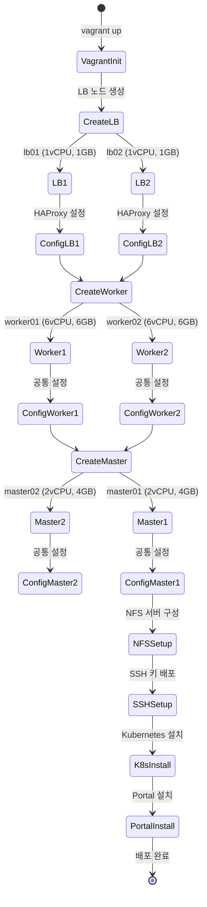

#### HAProxy 구성

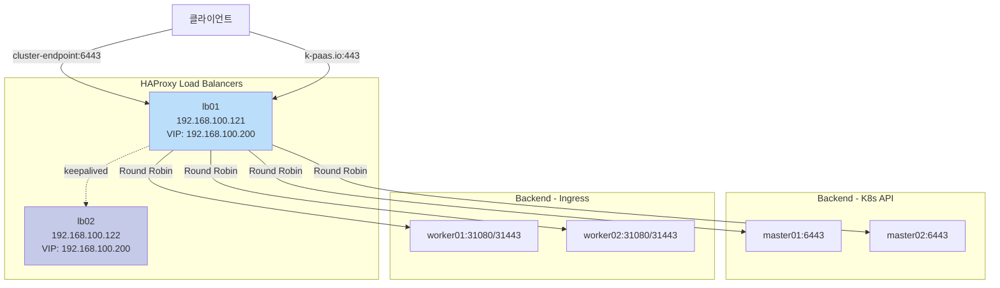

### 2. Terraform 클라우드 배포

#### Terraform 모듈 구조

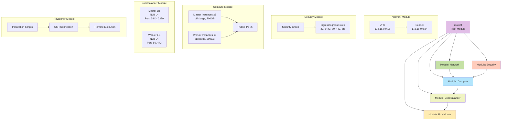

#### 리소스 의존성 그래프

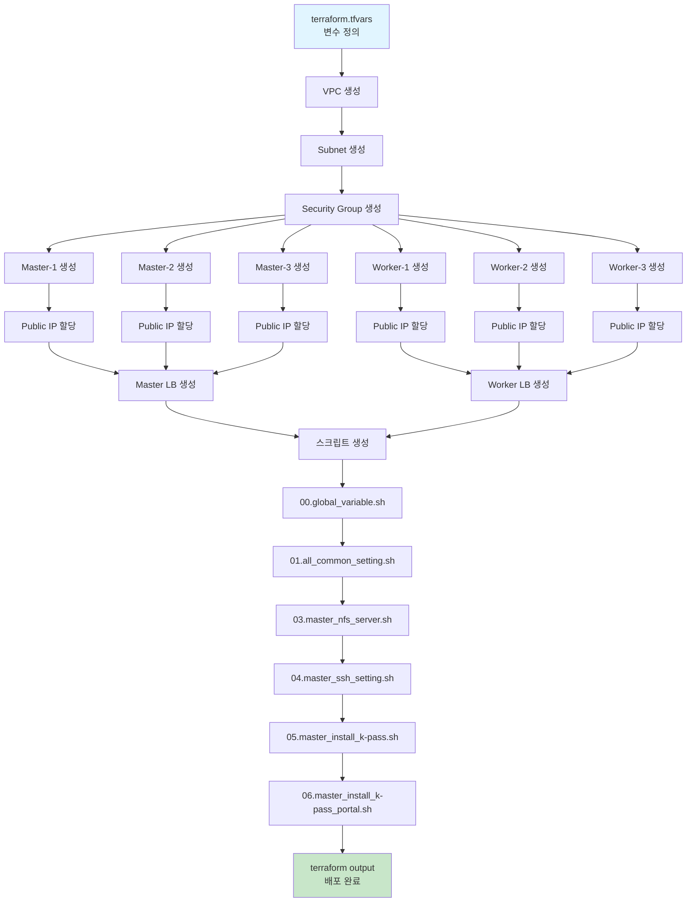

### 3. Kubernetes 설치 프로세스 (Kubespray)

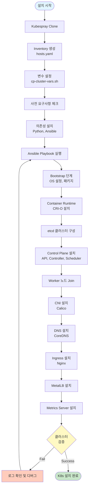

### 4. CP-Portal 설치 프로세스

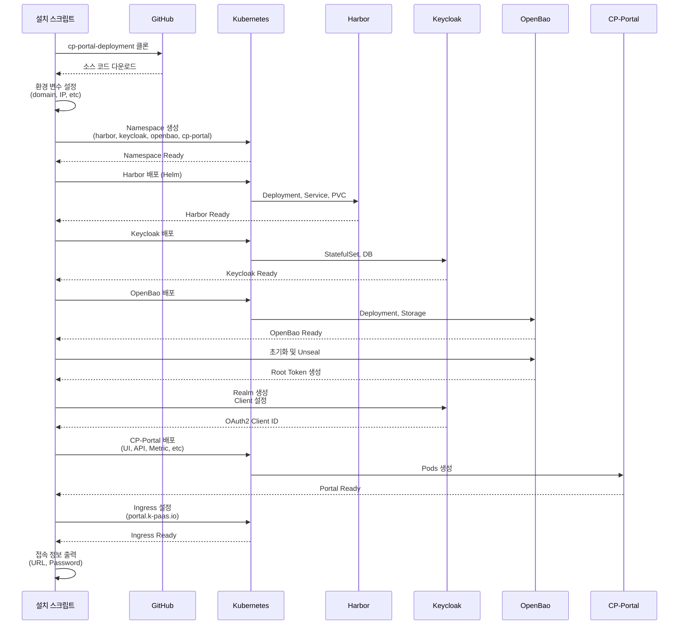

---

## 보안 구성

### 네트워크 보안 계층

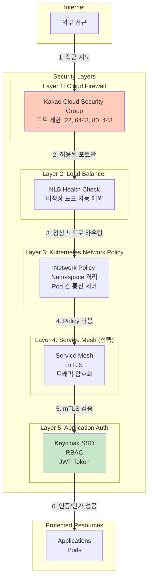

### Security Group 규칙 상세

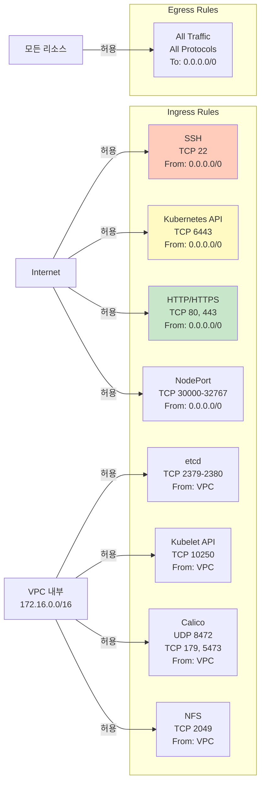

### 인증 및 인가 플로우

```mermaid
sequenceDiagram
    participant User as 사용자
    participant Portal as CP-Portal UI
    participant Keycloak as Keycloak
    participant K8sAPI as Kubernetes API
    participant RBAC as RBAC
    participant Resource as 리소스

    User->>Portal: 1. 로그인 시도
    Portal->>Keycloak: 2. 인증 요청<br/>(username, password)
    Keycloak->>Keycloak: 3. 사용자 검증<br/>(LDAP/DB)
    Keycloak-->>Portal: 4. JWT Token 발급<br/>(Access + Refresh)
    Portal-->>User: 5. 로그인 성공

    User->>Portal: 6. 리소스 요청<br/>(예: Pod 목록)
    Portal->>K8sAPI: 7. API 호출<br/>(Authorization: Bearer <token>)
    K8sAPI->>Keycloak: 8. Token 검증<br/>(OIDC)
    Keycloak-->>K8sAPI: 9. Token Valid + User Info

    K8sAPI->>RBAC: 10. 권한 확인<br/>(User, Verb, Resource)
    RBAC->>RBAC: 11. RoleBinding 조회
    RBAC-->>K8sAPI: 12. 권한 있음

    K8sAPI->>Resource: 13. 리소스 조회
    Resource-->>K8sAPI: 14. 데이터 반환
    K8sAPI-->>Portal: 15. 응답
    Portal-->>User: 16. UI 표시
```

### TLS/SSL 인증서 구조

```mermaid
graph TB
    subgraph "Certificate Authority"
        RootCA[Self-Signed CA<br/>k-paas-root-ca]
    end

    subgraph "Kubernetes Certificates"
        K8sCA[Kubernetes CA<br/>/etc/kubernetes/ssl/ca.crt]
        APICRT[API Server Cert<br/>apiserver.crt<br/>SAN: cluster-endpoint, *.k-paas.io]
        EtcdCRT[etcd Cert<br/>etcd/server.crt]
        KubeletCRT[Kubelet Certs<br/>kubelet-client.pem]
    end

    subgraph "Application Certificates"
        HarborCRT[harbor.k-paas.io.crt<br/>Self-Signed]
        KeycloakCRT[keycloak.k-paas.io.crt<br/>Self-Signed]
        PortalCRT[portal.k-paas.io.crt<br/>Self-Signed]
        OpenBaoCRT[openbao.k-paas.io.crt<br/>Self-Signed]
    end

    RootCA -->|서명| K8sCA
    K8sCA -->|서명| APICRT
    K8sCA -->|서명| EtcdCRT
    K8sCA -->|서명| KubeletCRT

    RootCA -->|서명| HarborCRT
    RootCA -->|서명| KeycloakCRT
    RootCA -->|서명| PortalCRT
    RootCA -->|서명| OpenBaoCRT

    style RootCA fill:#ffccbc
    style K8sCA fill:#fff9c4
    style HarborCRT fill:#c8e6c9
    style KeycloakCRT fill:#c8e6c9
    style PortalCRT fill:#c8e6c9
    style OpenBaoCRT fill:#c8e6c9
```

---

## 확장성 및 성능

### 수평 확장 (Scale-Out) 전략

```mermaid
graph TB
    subgraph "현재 구성 (6 Nodes)"
        M1[Master-1]
        M2[Master-2]
        M3[Master-3]
        W1[Worker-1]
        W2[Worker-2]
        W3[Worker-3]
    end

    subgraph "확장 시나리오 1: Worker 추가"
        W4[Worker-4<br/>NEW]
        W5[Worker-5<br/>NEW]
    end

    subgraph "확장 시나리오 2: Master 추가 (HA 강화)"
        M4[Master-4<br/>NEW<br/>etcd 5-node]
        M5[Master-5<br/>NEW<br/>etcd 5-node]
    end

    subgraph "자동 확장"
        HPA[Horizontal Pod Autoscaler<br/>CPU/Memory 기반<br/>자동 Pod 복제]
        CA[Cluster Autoscaler<br/>Node 부족 시<br/>자동 Node 추가]
    end

    W1 -.-> W4
    W2 -.-> W5

    M1 -.-> M4
    M2 -.-> M5

    W4 --> HPA
    HPA --> CA

    style W4 fill:#c8e6c9
    style W5 fill:#c8e6c9
    style M4 fill:#bbdefb
    style M5 fill:#bbdefb
```

### 성능 최적화 포인트

```mermaid
mindmap
  root((성능 최적화))
    Network
      MTU 최적화 1450
      TCP Window Scaling
      Connection Tracking 증가
      nf_conntrack_max 높이기
    Storage
      NFS rsize/wsize 1048576
      Async Mount
      I/O Scheduler deadline
      SSD Write-back Cache
    Kubernetes
      Resource Limits 적절 설정
      PodDisruptionBudget 설정
      Node Affinity 활용
      Anti-Affinity Pod 분산
    Application
      Connection Pooling
      Database Index 최적화
      Redis Caching
      CDN 정적 콘텐츠
    Monitoring
      Prometheus Metrics
      Grafana Dashboard
      Alert Manager
      Resource 모니터링
```

### 고가용성 (HA) 구성

```mermaid
graph TB
    subgraph "Control Plane HA"
        LB[Master Load Balancer<br/>Health Check: /healthz]
        M1[Master-1<br/>Active]
        M2[Master-2<br/>Active]
        M3[Master-3<br/>Active]

        LB --> M1
        LB --> M2
        LB --> M3

        M1 -.etcd Raft.-> M2
        M2 -.etcd Raft.-> M3
        M3 -.etcd Raft.-> M1
    end

    subgraph "etcd Quorum"
        Quorum[Quorum: 2/3<br/>Fault Tolerance: 1 node<br/>Leader Election: Raft]
    end

    subgraph "Worker HA"
        W1[Worker-1<br/>Pod Replica 1]
        W2[Worker-2<br/>Pod Replica 2]
        W3[Worker-3<br/>Pod Replica 3]

        W1 -.Pod Anti-Affinity.-> W2
        W2 -.Pod Anti-Affinity.-> W3
    end

    subgraph "Data HA"
        NFS[NFS Server<br/>Master-1]
        Backup[NFS Backup<br/>Daily rsync]
        NFS -.-> Backup
    end

    M1 -.-> Quorum
    M2 -.-> Quorum
    M3 -.-> Quorum

    M1 --> W1
    M1 --> W2
    M1 --> W3

    W1 --> NFS
    W2 --> NFS
    W3 --> NFS

    style LB fill:#ffccbc
    style Quorum fill:#fff9c4
    style NFS fill:#c8e6c9
    style Backup fill:#b2dfdb
```

### 장애 복구 시나리오

```mermaid
stateDiagram-v2
    [*] --> Normal: 정상 운영

    Normal --> MasterFail: Master 노드 1개 장애
    Normal --> WorkerFail: Worker 노드 1개 장애
    Normal --> LBFail: Load Balancer 장애
    Normal --> NFSFail: NFS 서버 장애

    MasterFail --> AutoRecover1: etcd Quorum 유지<br/>(2/3 정상)
    AutoRecover1 --> Normal: 자동 복구<br/>LB Health Check

    WorkerFail --> AutoRecover2: Pod 재스케줄링<br/>(다른 Worker로 이동)
    AutoRecover2 --> Normal: 자동 복구

    LBFail --> ManualRecover1: 수동 복구 필요<br/>LB 재시작
    ManualRecover1 --> Normal

    NFSFail --> ManualRecover2: 수동 복구<br/>Backup에서 복원
    ManualRecover2 --> Normal

    MasterFail --> QuorumLost: etcd Quorum 상실<br/>(2개 이상 장애)
    QuorumLost --> Emergency: 긴급 복구 모드
    Emergency --> Restore: etcd Snapshot 복원
    Restore --> Normal
```

---

## 주요 설치 스크립트 분석

### 스크립트 실행 순서

```mermaid
flowchart TD
    Start([스크립트 실행 시작]) --> Script00[00.global_variable.sh<br/>전역 환경 변수 설정]

    Script00 --> Script01[01.all_common_setting.sh<br/>모든 노드 공통 설정]

    subgraph "공통 설정 내용"
        Hosts[/etc/hosts 설정]
        Swap[Swap 비활성화]
        Firewall[방화벽 설정]
        Packages[필수 패키지 설치<br/>curl, wget, git, etc]
        Kernel[커널 모듈 로드<br/>br_netfilter, overlay]
    end

    Script01 --> Script02{노드 타입?}

    Script02 -->|LB 노드| Script02LB[02.lb_haproxy.sh<br/>HAProxy 설치 및 설정]
    Script02LB --> End1([LB 노드 완료])

    Script02 -->|Worker 노드| End2([Worker 노드 대기])

    Script02 -->|Master 노드| Script03[03.master_nfs_server.sh<br/>NFS 서버 설정]

    Script03 --> Script04[04.master_ssh_setting.sh<br/>SSH 키 배포]

    Script04 --> Script05[05.master_install_k-pass.sh<br/>Kubernetes 클러스터 설치]

    subgraph "K8s 설치 내용"
        Clone[Kubespray Clone]
        Inventory[Inventory 생성]
        Vars[변수 설정]
        Ansible[Ansible Playbook 실행]
        Verify[클러스터 검증]
    end

    Script05 --> Script06[06.master_install_k-pass_portal.sh<br/>CP-Portal 설치]

    subgraph "Portal 설치 내용"
        Harbor[Harbor 배포]
        Keycloak[Keycloak 배포]
        OpenBao[OpenBao 배포]
        PortalUI[CP-Portal UI/API 배포]
        Ingress[Ingress 설정]
    end

    Script06 --> End3([Master 노드 완료<br/>전체 설치 완료])

    style Start fill:#e1f5ff
    style End1 fill:#c8e6c9
    style End2 fill:#fff9c4
    style End3 fill:#81c784
```

### 주요 스크립트 상세

#### 1. 00.global_variable.sh

```bash
# 주요 환경 변수 설정
K8S_VERSION="v1.33.5"
KPAAS_VERSION="1.6.2"
MASTER_IP="192.168.100.101"
VIP_ADDRESS="192.168.100.200"
METALLB_IP_RANGE="192.168.100.210-192.168.100.250"
INGRESS_NGINX_IP="192.168.100.201"
DOMAIN="k-paas.io"
```

#### 2. 05.master_install_k-pass.sh 주요 단계

```mermaid
sequenceDiagram
    participant Script as 스크립트
    participant Git as GitHub
    participant Kubespray as Kubespray
    participant Ansible as Ansible
    participant K8s as Kubernetes

    Script->>Git: Kubespray 저장소 클론
    Git-->>Script: 소스 다운로드

    Script->>Script: Python venv 생성<br/>의존성 설치
    Script->>Script: Inventory 파일 생성<br/>(hosts.yaml)

    Script->>Kubespray: 변수 파일 설정<br/>(all.yml, k8s-cluster.yml)

    Script->>Ansible: cluster.yml 실행
    Ansible->>K8s: Bootstrap OS
    Ansible->>K8s: etcd 설치
    Ansible->>K8s: Control Plane 설치
    Ansible->>K8s: Worker 조인
    Ansible->>K8s: CNI (Calico) 설치
    Ansible->>K8s: Add-ons 설치

    K8s-->>Script: 클러스터 Ready

    Script->>K8s: kubectl get nodes
    K8s-->>Script: 노드 상태 확인
```

---

## 모니터링 및 로깅

### 모니터링 아키텍처

```mermaid
graph TB
    subgraph "Data Sources"
        K8s[Kubernetes Metrics<br/>kube-state-metrics]
        Node[Node Exporter<br/>시스템 메트릭]
        App[Application Metrics<br/>/metrics endpoint]
        CAdvisor[cAdvisor<br/>Container 메트릭]
    end

    subgraph "Collection Layer"
        Prometheus[Prometheus<br/>Time-Series DB<br/>메트릭 수집/저장]
    end

    subgraph "Visualization Layer"
        Grafana[Grafana<br/>Dashboard<br/>시각화]
    end

    subgraph "Alerting Layer"
        AlertManager[Alert Manager<br/>알림 관리]
        Webhook[Webhook<br/>Slack, Email, etc]
    end

    subgraph "Logging Layer"
        FluentBit[Fluent Bit<br/>Log Collector]
        Loki[Loki<br/>Log Aggregation]
        LogDash[Grafana<br/>Log Viewer]
    end

    K8s --> Prometheus
    Node --> Prometheus
    App --> Prometheus
    CAdvisor --> Prometheus

    Prometheus --> Grafana
    Prometheus --> AlertManager

    AlertManager --> Webhook

    K8s -.logs.-> FluentBit
    Node -.logs.-> FluentBit
    App -.logs.-> FluentBit

    FluentBit --> Loki
    Loki --> LogDash

    style Prometheus fill:#ffccbc
    style Grafana fill:#c8e6c9
    style AlertManager fill:#fff9c4
```

### 주요 메트릭

| 카테고리 | 메트릭 | 설명 |
|---------|--------|------|
| **클러스터** | `kube_node_status_condition` | 노드 상태 |
| | `kube_pod_status_phase` | Pod 상태 |
| | `kube_deployment_status_replicas` | Deployment 복제본 수 |
| **리소스** | `node_cpu_seconds_total` | CPU 사용률 |
| | `node_memory_MemAvailable_bytes` | 메모리 가용량 |
| | `node_filesystem_avail_bytes` | 디스크 가용 공간 |
| **네트워크** | `node_network_receive_bytes_total` | 네트워크 수신 |
| | `node_network_transmit_bytes_total` | 네트워크 송신 |
| **애플리케이션** | `http_requests_total` | HTTP 요청 수 |
| | `http_request_duration_seconds` | 응답 시간 |

---

## 문제 해결 가이드

### 일반적인 문제 및 해결

```mermaid
flowchart TD
    Problem{문제 발생}

    Problem -->|Pod 시작 안됨| PodIssue[Pod 문제]
    Problem -->|서비스 접근 안됨| SvcIssue[Service 문제]
    Problem -->|노드 Not Ready| NodeIssue[Node 문제]
    Problem -->|인증 실패| AuthIssue[인증 문제]

    PodIssue --> CheckPod[kubectl describe pod]
    CheckPod --> PodReason{원인?}
    PodReason -->|ImagePullBackOff| FixImage[이미지 확인<br/>Registry 접근 확인]
    PodReason -->|CrashLoopBackOff| FixCrash[로그 확인<br/>kubectl logs]
    PodReason -->|Pending| FixPending[리소스 부족<br/>노드 확인]

    SvcIssue --> CheckSvc[kubectl get svc, ep]
    CheckSvc --> SvcReason{원인?}
    SvcReason -->|Endpoint 없음| FixEP[Pod Selector 확인<br/>Pod 상태 확인]
    SvcReason -->|LoadBalancer Pending| FixLB[MetalLB 설정 확인<br/>IP Pool 확인]

    NodeIssue --> CheckNode[kubectl describe node]
    CheckNode --> NodeReason{원인?}
    NodeReason -->|Disk Pressure| FixDisk[디스크 정리<br/>Docker 이미지 삭제]
    NodeReason -->|Memory Pressure| FixMem[메모리 확보<br/>Pod Eviction]
    NodeReason -->|Network 문제| FixNet[CNI 확인<br/>Calico 재시작]

    AuthIssue --> CheckAuth[Token 확인]
    CheckAuth --> AuthReason{원인?}
    AuthReason -->|Token 만료| FixToken[Keycloak에서<br/>새 Token 발급]
    AuthReason -->|권한 없음| FixPerm[RBAC 설정 확인<br/>RoleBinding 확인]

    FixImage --> Resolved([해결])
    FixCrash --> Resolved
    FixPending --> Resolved
    FixEP --> Resolved
    FixLB --> Resolved
    FixDisk --> Resolved
    FixMem --> Resolved
    FixNet --> Resolved
    FixToken --> Resolved
    FixPerm --> Resolved

    style Problem fill:#ffccbc
    style Resolved fill:#c8e6c9
```

### 디버깅 명령어 체크리스트

```mermaid
mindmap
  root((디버깅 명령어))
    클러스터 상태
      kubectl cluster-info
      kubectl get nodes -o wide
      kubectl get componentstatuses
      kubectl top nodes
    Pod 문제
      kubectl get pods -A
      kubectl describe pod POD_NAME
      kubectl logs POD_NAME
      kubectl logs POD_NAME --previous
      kubectl exec -it POD_NAME -- bash
    Service 문제
      kubectl get svc -A
      kubectl get endpoints
      kubectl describe svc SERVICE_NAME
      kubectl get ingress -A
    네트워크 문제
      kubectl get netpol
      ip addr show
      ip route show
      iptables -L -n -v
      calicoctl node status
    스토리지 문제
      kubectl get pv,pvc -A
      kubectl describe pv PV_NAME
      showmount -e NFS_SERVER
      df -h
    이벤트 확인
      kubectl get events -A --sort-by='.lastTimestamp'
      kubectl describe node NODE_NAME
```

---

## 참고 자료

### 공식 문서

- **K-PaaS**: https://github.com/k-paas
- **Kubernetes**: https://kubernetes.io/docs/
- **Kubespray**: https://kubespray.io/
- **Terraform**: https://www.terraform.io/docs/
- **Kakao Cloud**: https://cloud.kakao.com/docs/

### 주요 컴포넌트 문서

- **Harbor**: https://goharbor.io/docs/
- **Keycloak**: https://www.keycloak.org/documentation
- **OpenBao**: https://openbao.org/docs/
- **Calico**: https://docs.tigera.io/calico/latest/
- **MetalLB**: https://metallb.universe.tf/

### 프로젝트 파일

| 파일 | 경로 | 설명 |
|------|------|------|
| 메인 README | `/README.md` | 프로젝트 개요 |
| Kakao Cloud README | `/csp/kakao-cloud/terraform/README.md` | Terraform 배포 가이드 |
| 아키텍처 문서 | `/csp/kakao-cloud/terraform/ARCHITECTURE.md` | 상세 아키텍처 |
| 설치 가이드 | `/INSTALL.md` | 설치 매뉴얼 |

---

## 버전 정보

| 구분 | 버전 | 릴리스 날짜 |
|------|------|------------|
| **프로젝트** | 2.0.0 | 2025 |
| **K-PaaS** | 1.6.2 | 2024 |
| **Kubernetes** | v1.33.5 | 2025 |
| **CRI-O** | v1.33.5 | 2025 |
| **Ubuntu (로컬)** | 22.04 LTS | 2022 |
| **Ubuntu (클라우드)** | 24.04 LTS | 2024 |
| **Terraform** | >= 1.0 | - |
| **Vagrant** | >= 2.0 | - |

---

## 라이선스

이 프로젝트는 **Apache License 2.0** 라이선스를 따릅니다.

---

## 기여자

- **Kiha Lee** ([dasomel](https://github.com/dasomel)) - Founder

### 지원 기관

이 프로젝트는 [Kakao Enterprise](https://kakaoenterprise.com)의 지원을 받아 개발되었습니다.

---

## 문의 및 지원

- **Issues**: GitHub Issues 페이지
- **문서**: 프로젝트 내 README.md 및 docs/ 디렉토리
- **로그**: `/home/ubuntu/kpaas_install.log` (클라우드 배포 시)

---

**생성일**: 2025-11-30
**문서 버전**: 1.0.0
**작성**: Claude AI (Anthropic)
