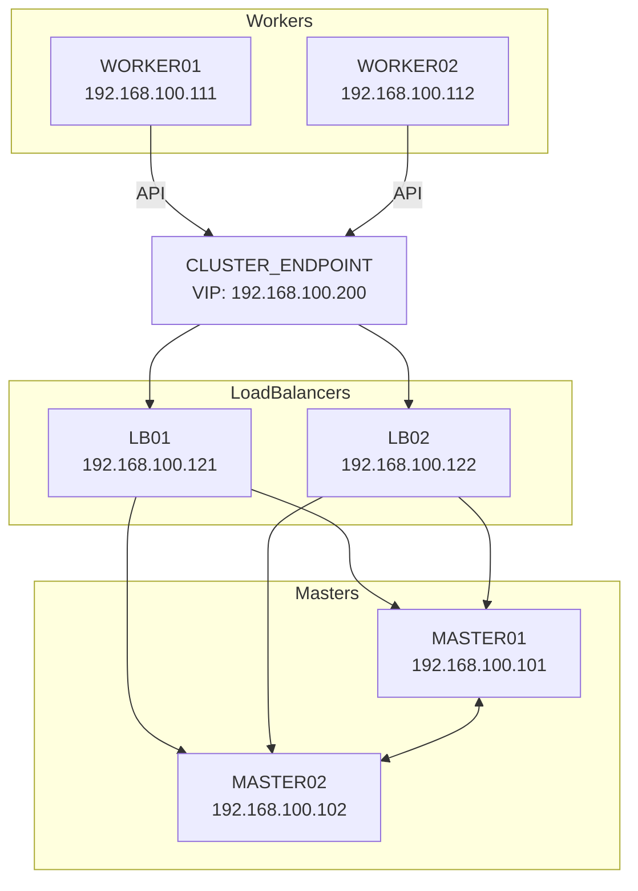

# Architecture

K-PaaS 로컬 클러스터 아키텍처

## 클러스터 구성도

```
┌─────────────────────────────────────────────────────────────┐
│                    Host PC (Mac/Linux/Windows)              │
├─────────────────────────────────────────────────────────────┤
│  ┌─────────┐ ┌─────────┐                                    │
│  │  LB01   │ │  LB02   │  HAProxy + Keepalived              │
│  │ .121    │ │ .122    │  CPU: 1, Memory: 1GB               │
│  └────┬────┘ └────┬────┘                                    │
│       │           │                                         │
│       └─────┬─────┘                                         │
│             │ VIP: 192.168.100.200                          │
│             ▼                                               │
│  ┌─────────────────────────────────────────┐                │
│  │           K8s Control Plane             │                │
│  │  ┌─────────┐        ┌─────────┐         │                │
│  │  │ Master01│        │ Master02│         │                │
│  │  │ .101    │        │ .102    │         │                │
│  │  │ CPU:2   │        │ CPU:2   │         │                │
│  │  │ Mem:4GB │        │ Mem:4GB │         │                │
│  │  └─────────┘        └─────────┘         │                │
│  └─────────────────────────────────────────┘                │
│             │                                               │
│             ▼                                               │
│  ┌─────────────────────────────────────────┐                │
│  │              K8s Workers                │                │
│  │  ┌─────────┐        ┌─────────┐         │                │
│  │  │ Worker01│        │ Worker02│         │                │
│  │  │ .111    │        │ .112    │         │                │
│  │  │ CPU:6   │        │ CPU:6   │         │                │
│  │  │ Mem:6GB │        │ Mem:6GB │         │                │
│  │  │ Disk:50G│        │ Disk:50G│         │                │
│  │  └─────────┘        └─────────┘         │                │
│  └─────────────────────────────────────────┘                │
└─────────────────────────────────────────────────────────────┘
```

## 네트워크 구성



## IP 할당

| 노드 | IP | 역할 |
|------|-----|------|
| lb01 | 192.168.100.121 | HAProxy (Primary) |
| lb02 | 192.168.100.122 | HAProxy (Backup) |
| master01 | 192.168.100.101 | K8s Master, NFS Server |
| master02 | 192.168.100.102 | K8s Master |
| worker01 | 192.168.100.111 | K8s Worker |
| worker02 | 192.168.100.112 | K8s Worker |
| VIP | 192.168.100.200 | Cluster API Endpoint |
| Ingress | 192.168.100.201 | Portal/Services |
| MetalLB | 192.168.100.210-250 | LoadBalancer Pool |

## 컴포넌트 배치

### Kubernetes 핵심

| Namespace | 컴포넌트 | 설명 |
|-----------|----------|------|
| kube-system | Calico | CNI (네트워크) |
| kube-system | CoreDNS | 클러스터 DNS |
| kube-system | Metrics Server | 리소스 메트릭 |
| metallb-system | MetalLB | Bare Metal LB |
| ingress-nginx | Ingress NGINX | Ingress Controller |

### K-PaaS Portal

| Namespace | 컴포넌트 | 설명 |
|-----------|----------|------|
| harbor | Harbor | Container Registry |
| keycloak | Keycloak | SSO/Identity Provider |
| mariadb | MariaDB | Database |
| openbao | OpenBao | Secrets Management |
| chartmuseum | ChartMuseum | Helm Repository |
| cp-portal | CP-Portal | Portal API/UI (12 pods) |
| kyverno | Kyverno | Policy Engine |
| chaos-mesh | Chaos Mesh | Chaos Engineering |

## 스토리지

- **NFS Server**: master01 (`/home/share/nfs`)
- **StorageClass**: `cp-storageclass` (NFS Provisioner)
- **PVC**: 각 컴포넌트별 자동 프로비저닝

## 외부 접속

Host PC `/etc/hosts` 설정:
```
192.168.100.200 cluster-endpoint
192.168.100.201 k-paas.io
192.168.100.201 portal.k-paas.io
192.168.100.201 harbor.k-paas.io
192.168.100.201 keycloak.k-paas.io
192.168.100.201 chartmuseum.k-paas.io
```
